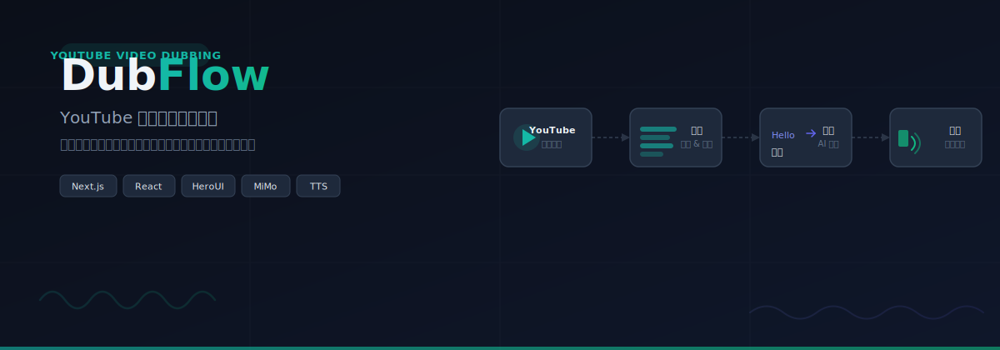

<p align="center">
  
</p>

<p align="center">
  <a href="#快速开始">快速开始</a> · <a href="#功能特性">功能特性</a> · <a href="#技术栈">技术栈</a> · <a href="#部署">部署</a>
</p>

---

DubFlow 是一个 YouTube 视频智能配音平台。粘贴一个 YouTube 链接，系统自动完成字幕提取、AI 翻译、语音合成，生成中文配音版本。支持声音克隆和音色自定义，让配音效果更自然。

## 功能特性

**YouTube 集成** — 粘贴链接即可解析视频信息，支持字幕下载与自动翻译，一键加载到字幕编辑器。

**字幕编辑器** — 可视化编辑双语字幕，逐条校对原文与译文，调整时间轴。

**AI 翻译** — 接入 MiMo 大模型，支持多语言互译，自动保持字幕的时间戳对齐。

**语音合成** — 内置多种音色，支持通过自然语言描述设计自定义音色，也可以上传参考音频克隆声音。

**视频导出** — 将翻译后的字幕与配音音频合成为完整视频，支持 SRT 字幕文件和音频文件分别导出。

**多配置方案** — API Key 按配置方案管理，方便在不同环境和模型之间切换。

## 快速开始

### 环境要求

- Node.js 18+
- npm / pnpm / yarn

### 安装与启动

```bash
git clone https://github.com/TIUCSIB/DubFlow.git
cd DubFlow
npm install
npm run dev
```

打开浏览器访问 [http://localhost:3000](http://localhost:3000)。

### 配置 API Key

API Key 在应用内的设置面板中配置，支持创建多个配置方案并随时切换，数据存储在浏览器本地。

也可以选择在项目根目录创建 `.env.local` 文件，将 `MIMO_API_KEY` 作为默认的 fallback：

```env
MIMO_API_KEY=your_mimo_api_key
```

## 使用流程

1. **输入内容** — 选择输入方式：粘贴 YouTube 链接、上传音频/视频文件、上传 SRT 字幕，或直接输入文本。
2. **获取字幕** — YouTube 视频自动提取字幕并翻译，音频文件通过语音识别生成字幕。
3. **编辑校对** — 在字幕编辑器中逐条检查和修改原文与译文。
4. **选择音色** — 从内置音色中选择，或通过描述/克隆创建自定义音色。
5. **合成导出** — 生成中文配音音频，导出为视频或单独的音频/SRT 文件。

## 技术栈

| 技术 | 用途 |
|------|------|
| Next.js 16 (App Router) | 全栈框架 |
| React 19 | UI 层 |
| HeroUI v3 | 组件库 |
| Tailwind CSS v4 | 样式系统 |
| youtubei.js | YouTube 数据获取 |
| MiMo API | AI 翻译 |
| TTS API | 语音合成 |

## 项目结构

```
src/
├── app/
│   ├── api/              # API 路由
│   │   ├── youtube/      # YouTube 解析、下载、字幕
│   │   ├── process/      # 字幕处理与翻译
│   │   ├── translate/    # 文本翻译
│   │   ├── tts/          # 语音合成
│   │   ├── asr/          # 语音识别
│   │   ├── clone-voice/  # 声音克隆
│   │   ├── design-voice/ # 声音设计
│   │   └── export/       # 视频导出
│   ├── layout.tsx        # 根布局
│   ├── page.tsx          # 主页面
│   └── globals.css       # 全局样式
├── components/           # UI 组件
│   ├── YouTubeDownloader # YouTube 下载器
│   ├── SubtitleEditor    # 字幕编辑器
│   ├── VoiceSelector     # 音色选择器
│   ├── ExportPanel       # 导出面板
│   └── ...
├── lib/                  # 工具函数
│   ├── youtube.ts        # YouTube API 封装
│   ├── mimo.ts           # MiMo 翻译封装
│   ├── subtitle.ts       # 字幕解析
│   └── translation-providers.ts
└── types/                # TypeScript 类型
```

## 部署

### Vercel

[](https://vercel.com/new/clone?repository-url=https://github.com/TIUCSIB/DubFlow)

### 手动部署

```bash
npm run build
npm run start
```

## 许可证

MIT License
